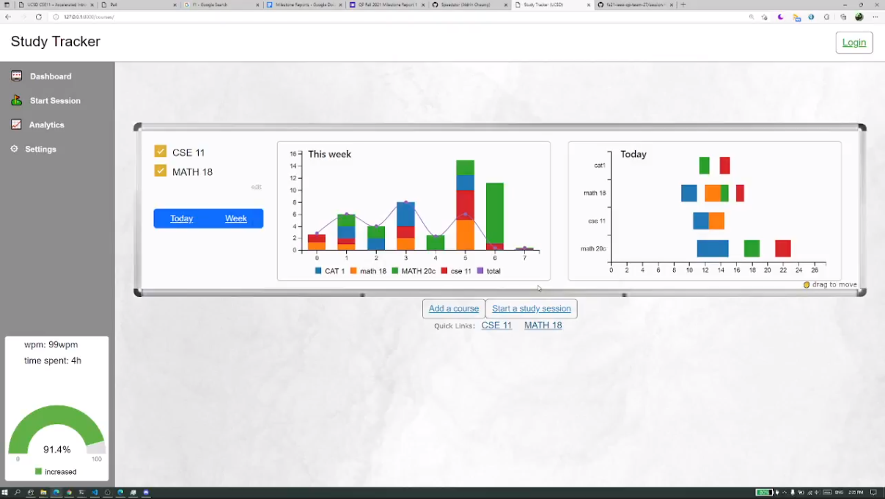
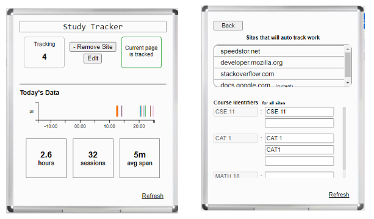

# Study Tracker
#### UCSD IEEE Competition - `Most Technical Award: Team 27`
  
Project repository for team 27
```
this project lost traction over time. Archived for now.
```

### Project Description
The project theme for Fall Quarter 2022 was automation, and our team wanted to create software that could help automate an aspect of UCSD students’ daily lives. We created a web application that helps students track the amount of time they spend on each of their courses, called “Study Tracker.”

### Purpose and Motivation
There are two main problems we identified: 1) the lack of a convenient way to track one’s study habits and 2) the lack of an automated reminder for users to take a break from studying. 

For problem (1), one could manually log the time they spend on coursework (for example, through Microsoft Excel or Google Sheets), but this can become tedious. In addition, if users want to visualize how much time they are spending daily and weekly, they would have to keep timestamps on each of their study sessions.

For problem (2), it can be difficult for users to know when they have become too tired to be productive with studying. Sometimes, students may work for long periods of time without taking a break, because their work is complex or requires a lot of focus. 

The study tracker app addresses these two problems with the following functions. 

First, it allows users to easily log the amount of time they spend doing work for each of their courses. Moreover, it provides users with a daily and weekly visualization of their study habits so that this information is more easily digestible.

Second, the app will periodically remind users to take a break by detecting whether the user is drowsy. This drowsiness detection feature is meant to prevent users from getting burnt out from doing work when they are tired and unproductive.


## Chrome Extension
  

## Todo
- [ ] integrations
  - [ ] Google Doc
    - browser extension or google drive (need to decide)
  - [ ] Notion
  - [ ] evernote
  - [ ] joplin
  - [ ] photoshop
    - [ ] procreate
  - [ ] overleaf
  - [ ] onedrive
    - [ ] onenote
    - [ ] word
    - [ ] powerpoint
  - [ ] coding
    - [ ] vscode
    - [ ] visual studio 2019
